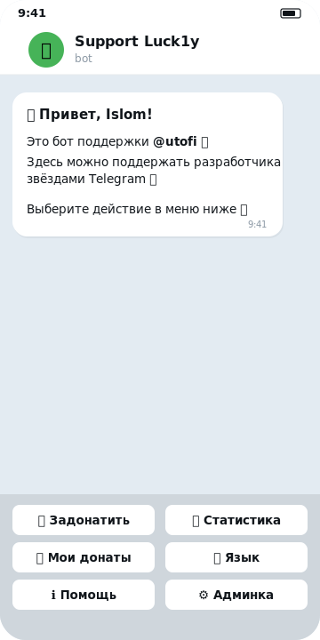
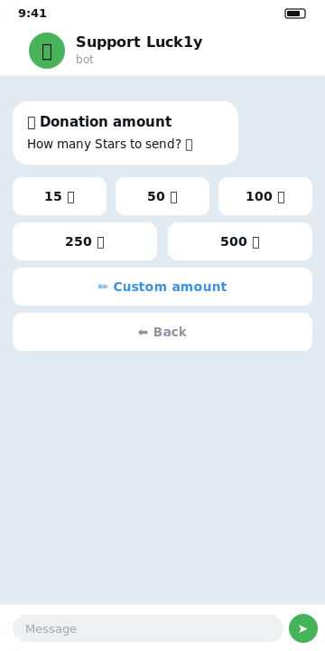
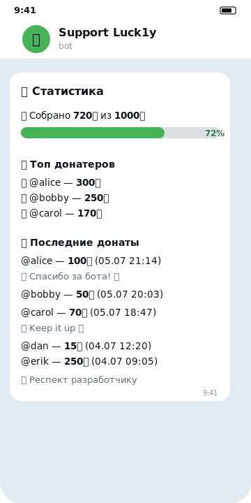
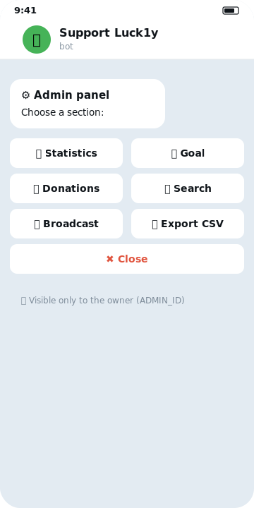

<div align="center">

# 💛 Support Luck1y — Telegram Stars Donation Bot

**A polished, production-ready Telegram bot for accepting donations via Telegram Stars (⭐️).**
Beautiful HTML-formatted UI, a full multilingual admin panel, and one-command deployment.

[](https://www.python.org/)
[](https://docs.aiogram.dev/)
[](https://core.telegram.org/bots/payments-stars)
[](#-license)

Bot username: **[@luck1y_support_bot](https://t.me/luck1y_support_bot)** · Developer: **[@utofi](https://t.me/utofi)**

</div>

---

## 📸 Screens

<div align="center">
<table>
<tr>
<td align="center"><br><sub><b>Welcome & menu</b></sub></td>
<td align="center"><br><sub><b>Donation flow</b></sub></td>
<td align="center"><br><sub><b>Public stats</b></sub></td>
<td align="center"><br><sub><b>Admin panel</b></sub></td>
</tr>
</table>
<sub><i>UI previews — rendered mockups of the real bot screens (en locale).</i></sub>
</div>

---

## ✨ Features

- 💳 **Donations in Telegram Stars** — preset amounts (15 / 50 / 100 / 250 / 500 ⭐️) or any custom value.
- 💬 **Optional message** attached to each donation, shown in public stats.
- 🎯 **Fundraising goal** with a live text progress bar; auto-detects when a goal is reached and prompts for a new one.
- 📊 **Public statistics** — goal progress, top-5 donors (🥇🥈🥉) and the latest donations.
- 👤 **Donor profile** — personal donation history and self-service refunds within 24 hours.
- ↩️ **Refunds** — donors can refund within 24 h; the admin can refund any donation at any time.
- 📩 **Contact the developer** — users can send text, photos, voice notes, video, documents or stickers straight to the admin (no native "forwarded" badge), with a per-message cooldown and an admin Block/Reply button to stop spam.
- 🌐 **Three languages** — Russian, Uzbek and English, switchable at any moment.
- ⚙️ **Full admin panel** (see below) — stats, goal management, donation browser, broadcast, CSV export and search.
- 💾 **Automatic backups** — a consistent nightly DB snapshot is zipped and sent to the admin's DM; restore any backup right from chat (see below).
- 🎨 **Beautiful UI** — HTML formatting (bold/italic), tasteful emoji, inline navigation with “Back” on every step.
- 🚀 **Easy deployment** — Docker/Railway, or locally on Windows.

---

## ⚙️ Admin panel

The **⚙️ Admin** button appears in the bottom menu **only** for the account listed in `ADMIN_ID`
(you can also open it with `/admin`). The whole panel is localized into all three languages.

| Section | What it does |
| --- | --- |
| 📊 **Statistics** | Users, donors, donation & refund counts, total collected, current goal progress. |
| 🎯 **Goal** | View / set / reset the fundraising goal (buttons or `/setgoal <n>`). |
| 💸 **Donations** | Paginated list of every donation; tap one to see details and refund it (no time limit). |
| 🔍 **Search** | Find donations by `user_id` or `username`. |
| 📢 **Broadcast** | Send a text message to all bot users, with a confirmation step and a delivery report. |
| 📤 **Export CSV** | Download all donations as a single CSV file (opens cleanly in Excel). |
| 📩 **Contact inbox** | Every incoming message from a user arrives with inline **Reply** / **Block** buttons — no separate screen needed. |
| 🗄 **Backup / restore** | Create a DB backup on demand or restore from an uploaded file (see [Backups](#-backups)). |

---

## 💾 Backups

The bot protects your data with **consistent snapshots** taken through SQLite's
online backup API (`aiosqlite.backup()`) rather than a raw file copy — so a
backup is safe to take while the bot is running and can never produce a torn or
corrupt copy. Each snapshot is zipped and delivered to the admin's DM as a file.

- **Automatic** — every day at **03:00** (server time) the bot sends a fresh
  backup to `ADMIN_ID`, scheduled with APScheduler.
- **On demand** — the `/backup` command or the **📦 Create backup** button in the
  admin panel.
- **Restore** — reply to the backup file with `/restore` (accepts
  `stars_backup.zip` or a raw `.db`), or use the **♻️ Restore** button. Before
  overwriting, the bot verifies the file is a real bot database (it must contain
  the `users` table) and asks for confirmation — the current data is **fully
  replaced**, which is irreversible. The replace also runs through the online
  backup API.

> With a Railway Volume mounted at `/data`, both `bot.db` and backups survive
> redeploys; even if the volume is lost, the latest backup is always in the
> admin's Telegram DM.

---

## 🧰 Tech stack

- **Python 3.11+**
- **[aiogram 3.x](https://docs.aiogram.dev/)** — async Telegram Bot framework
- **[aiosqlite](https://github.com/omnilib/aiosqlite)** — async SQLite (plain SQL, no ORM)
- **[python-dotenv](https://github.com/theskumar/python-dotenv)** — environment configuration
- **[APScheduler](https://apscheduler.readthedocs.io/)** — nightly automatic DB backups

> Telegram Stars payments work **out of the box** — no payment provider, no `provider_token`, no bank setup.

---

## 🚀 Quick start (local)

```bash
# 1. Enter the project folder
cd Stars-Donate

# 2. Create a virtual environment
python -m venv venv
# Windows:
venv\Scripts\activate
# Linux / macOS:
source venv/bin/activate

# 3. Install dependencies
pip install -r requirements.txt

# 4. Create your .env from the template and fill it in
copy .env.example .env   # Windows
cp .env.example .env      # Linux / macOS

# 5. Run
python bot.py
```

The bot uses **long polling** — no open ports or domain required.
The SQLite database (`bot.db`) is created automatically on first launch.

**Even simpler on Windows:** double-click **`run.bat`** — it creates the venv, installs
dependencies and starts the bot for you.

After it starts, send the bot `/start`, pick a language, then set your first goal with `/setgoal 1000`.

---

## 🔐 Configuration

Copy `.env.example` to `.env` and fill in the values:

| Variable | Required | Description |
| --- | --- | --- |
| `BOT_TOKEN` | ✅ | Bot token from [@BotFather](https://t.me/BotFather). |
| `ADMIN_ID` | ✅ | Your numeric Telegram id — grants admin rights. |
| `THANK_YOU_STICKER_ID` | ⬜ | `file_id` of the “thank you” sticker (optional). |
| `DB_PATH` | ⬜ | SQLite file path (default `bot.db`; use `/data/bot.db` in Docker). |

<details>
<summary><b>How to get the bot token</b></summary>

1. Open [@BotFather](https://t.me/BotFather) → `/newbot`.
2. Name: `Support Luck1y`. Username: `luck1y_support_bot`.
3. Copy the token (`123456:AA...`) into `BOT_TOKEN`.

No payment provider is needed — Stars are supported natively.
</details>

<details>
<summary><b>How to get your ADMIN_ID</b></summary>

Open [@userinfobot](https://t.me/userinfobot), press Start, and copy the numeric `Id` into `ADMIN_ID`.
</details>

<details>
<summary><b>How to get a sticker file_id</b></summary>

Forward any sticker to [@idstickerbot](https://t.me/idstickerbot), copy the `file_id` into `THANK_YOU_STICKER_ID`.
Leave it empty to simply skip the sticker.
</details>

---

## 🐳 Deployment

### Railway (recommended, used in production)

1. Push this repo to GitHub.
2. Railway → New Project → *Deploy from GitHub repo*. It builds from the `Dockerfile`.
3. Add the environment variables `BOT_TOKEN`, `ADMIN_ID`, `THANK_YOU_STICKER_ID`
   (do **not** commit your `.env`).
4. Attach a **Railway Volume** mounted at `/data` so the SQLite database
   (`DB_PATH=/data/bot.db`, already set in the `Dockerfile`) survives redeploys.
5. It runs as a **worker** — long polling, no web port needed.

### Docker (local / self-hosted)

```bash
cp .env.example .env   # fill in your values
docker build -t donate-stars .
docker run -d --env-file .env -v donate_data:/data donate-stars
```

---

## 🗂️ Project structure

```
Stars-Donate/
├── bot.py                 # entry point, polling, scheduler start, HTML parse mode
├── config.py              # reads .env and constants
├── database.py            # all SQL queries (aiosqlite) + backup/restore helpers
├── backup.py              # consistent DB snapshot → zip → send to admin
├── scheduler.py           # APScheduler: nightly auto-backup at 03:00
├── locales.py             # ru / uz / en texts (HTML + emoji)
├── keyboards.py           # reply & inline keyboards
├── states.py              # FSM states (donation + admin flows)
├── handlers/
│   ├── start.py           # /start, language, help
│   ├── donate.py          # donation flow & Stars payments
│   ├── stats.py           # public statistics & goal bar
│   ├── profile.py         # my donations
│   ├── refund.py          # donor-side refunds
│   ├── contact.py         # message relay between users and the admin
│   └── admin.py           # full admin panel
├── Dockerfile             # used by Railway to build the bot
├── railway.json           # Railway deploy config (start command, restarts)
├── run.bat / run.ps1      # Windows launchers
├── requirements.txt
└── .env.example
```

---

## 💬 Commands

| Command | Who | Description |
| --- | --- | --- |
| `/start` | everyone | choose language and open the main menu |
| `/donate` | everyone | make a donation |
| `/stats` | everyone | statistics and goal progress |
| `/refund` | everyone | refund your last donation (within 24 h) |
| `/help` | everyone | help |
| `/admin` | admin | open the admin panel |
| `/setgoal <n>` | admin | set a new fundraising goal |
| `/refund <id>` | admin | refund any donation by id, no time limit |
| `/unblock <user_id>` | admin | restore a user's access to the contact feature |
| `/backup` | admin | create a DB backup now and receive it as a file |
| `/restore` | admin | restore the DB — reply to a backup file with this command |

---

## 🧠 How the goal works

Progress is measured as `(total_all_time − cycle_start_total)` against `goal_current`.
When progress hits 100 %:

1. `cycle_start_total` is set to the current all-time total (a new cycle begins).
2. The admin is notified that the goal was reached and prompted to set a new one via `/setgoal`.
3. Until a new goal is set, the progress bar shows 100 % and “waiting for an update”.

---

## 🔒 Security notes

- `.env`, `bot.db` and `venv/` are git-ignored — never commit your token.
- User-provided content (names, donation messages, search queries) is HTML-escaped before rendering.
- Admin actions are gated by a router-level `ADMIN_ID` filter; non-admins can’t reach the panel.
- The contact relay uses `copy_to` (not `forward`) so it never leaks the sender's chat metadata, and is rate-limited with a per-user cooldown plus an admin-controlled block flag to prevent spam.

---

## 📄 License

MIT — do whatever you like, attribution appreciated. Built with 💛 for [@utofi](https://t.me/utofi).
